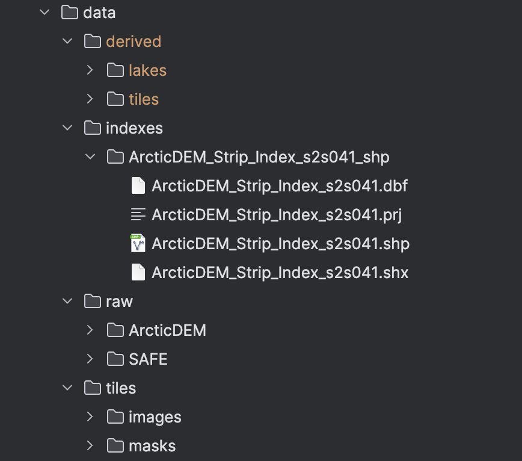

# How To Run on Local Machine
Joshua (Chang Hyeon) Park | University of Chicago

This guide walks through running the full pipeline on a small example: from raw Sentinel-2 Level-2A data and ArcticDEM strips
to U-Net lake segmentation outputs.

## Environment Setup:

## Data Directory Layout:

## Run:

Build VRT
Usage:

 python3 VRT/build_vrt.py \
  --index "data/indexes/ArcticDEM_Strip_Index_s2s041_shp/ArcticDEM_Strip_Index_s2s041.shp" \
  --out-dir "data/raw/ArcticDEM" \
  --sentinel-bounds 399960 7490220 509760 7600020 \
  --sentinel-crs EPSG:32622 \
  --buffer-m 1000 \
  --resolution 2m \
  --max-strips 5