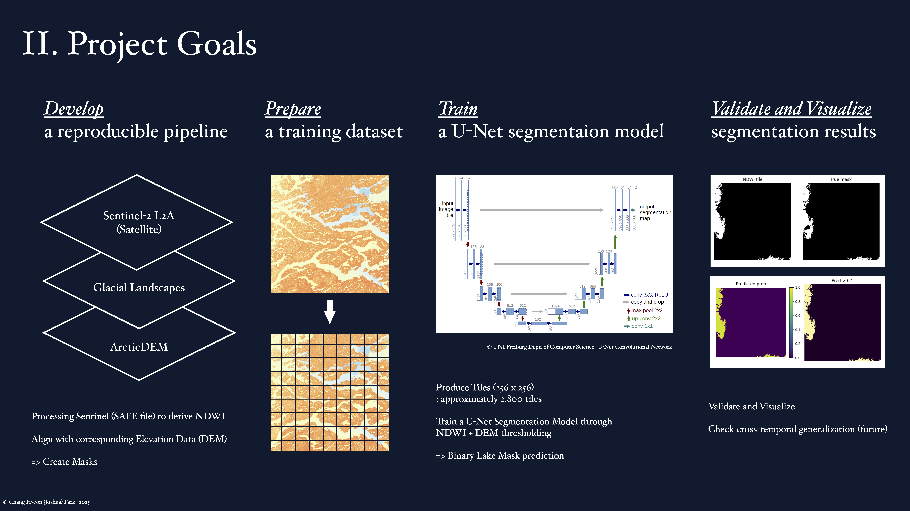
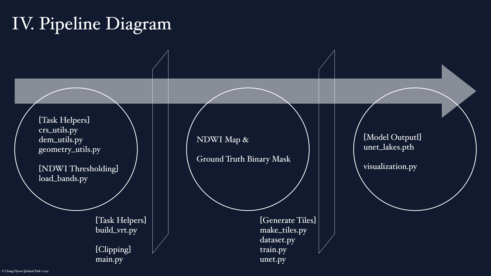
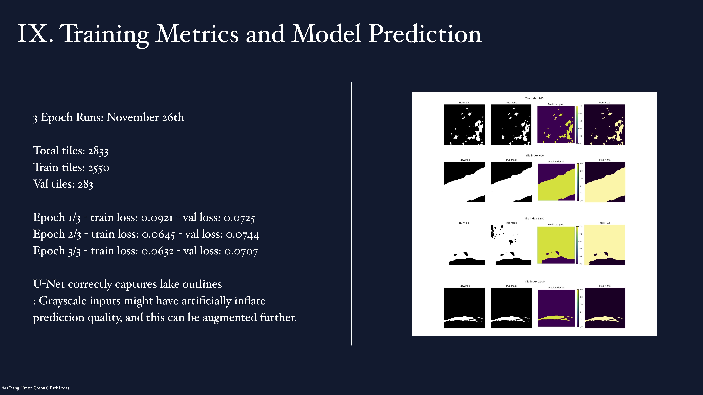

# Supraglacial Lake Detection Project | Fall 2025
Joshua (Chang Hyeon) Park | University of Chicago
## Project Motivation & Context:

As anthropogenic climate change accelerates surface melt across the polar regions, the retreat of marine-terminating glaciers has become a major contributor to global sea-level instability. On the Greenland Ice Sheet (GrIS), the rapid formation and drainage of supraglacial lakes play a critical role in hydrofracture and ice-flow acceleration.

This project applies computer vision techniques to Sentinel-2 imagery and trains a neural network to automatically detect and delineate supraglacial meltwater ponds.

## Project Description:
The Supraglacial Lake Detection Project focuses on automating the identification of melt ponds on Jakobshavn Glacier using a combination of satellite imagery, geospatial preprocessing, and a U-Net segmentation model. The goal is to build a fully reproducible workflow that transforms raw Sentinel-2 Level-2A imagery and ArcticDEM elevation data into spatially aligned datasets suitable for machine learning.

The project has two major components:

(1) Geospatial Data Preparation  
This includes locating and loading Sentinel-2 .SAFE directories, extracting CRS metadata, identifying overlapping ArcticDEM strips, building a VRT mosaic, reprojecting the DEM to match the Sentinel geometry, clipping rasters to a shared footprint, computing NDWI, and generating initial binary meltwater masks.

(2) Machine Learning Pipeline  
Using NDWI and corresponding masks, the project splits large rasters into 256×256 image tiles, constructs PyTorch datasets, trains a U-Net segmentation model, and visualizes predictions. This allows the network to learn melt pond characteristics beyond simple thresholding.

## Data Set Preparation:
#### Method Overview:
1. **CRS Extraction**  
Read EPSG codes and CRS metadata from Sentinel-2 .SAFE folders and ArcticDEM GeoTIFF files.
This ensures both datasets share a consistent spatial reference before any geometric operations.
2. **Geometric Pre-Flight check**  
Verify that the spatial bounds of Sentinel-2 imagery overlap with downloaded ArcticDEM tiles.
This prevents unnecessary reprojecting/clipping of DEMs that do not intersect the study region.
3. **DEM URL Extraction (ArcticDEM Mosaic to Strip URLs)**  
Identify which ArcticDEM strips overlap the Sentinel-2 footprint by filtering the mosaic index.
Extract corresponding download URLs to prepare inputs for VRT construction.
4. **DEM VRT Construction**  
Using the extracted strip URLs, build a unified DEM mosaic (.vrt) to standardize data access and minimize file handling.
5. **DEM Reprojection and Alignment**  
Match the DEM’s CRS, resolution, and grid to Sentinel-2 geometry.
This ensures that elevation and NDWI rasters share identical spatial coordinates.
6. **Footprint Clipping**  
Trim DEM mosaics to the exact Sentinel tile footprint.
Clipping ensures spatial consistency across all downstream products, including masks and training tiles.
7. **NDWI Computation & Mask Generation**  
Calculate NDWI using Sentinel-2 bands B03 and B08 to isolate meltwater features.
Apply thresholding to produce preliminary binary masks separating water from ice/snow.
These binary masks serve as ground truth labels for downstream model training.

## Machine Learning: 
#### Method Overview:
8. **Tile Generation for ML Training**  
Convert the NDWI raster and corresponding binary mask into overlapping fixed-size tiles (e.g., 256×256 with stride 128). Tiling enables the network to learn fine-scale spatial patterns and ensures adequate sample diversity across the glacier surface.
9. **Dataset Construction (PyTorch)**  
Package tiles into PyTorch datasets and dataloaders, normalizing inputs and pairing each tile with its mask. This step handles the train/val/test split and ensures consistent preprocessing for model ingestion.
10. **U-Net Model Training**
Train a convolutional U-Net to segment meltwater features from input tiles. The encoder–decoder architecture, with skip connections and 3×3 convolution blocks, allows the network to integrate both global context and fine-grained spatial detail. Training optimizes a segmentation loss (e.g., BCE or Dice) to improve alignment between predictions and binary meltwater masks.
11. **Prediction & Probability Maps**  
Run the trained model on withheld validation tiles to generate per-pixel probability maps. These maps highlight uncertain boundaries, thin melt channels, and partially flooded areas that simple NDWI thresholding cannot reliably detect.
13. **Evaluation and Visualization**  
Compare predicted masks with ground-truth binary masks using metrics such as Intersection-over-Union (IoU), precision, recall, and pixel accuracy. Visualize NDWI, true masks, prediction maps, and thresholded outputs side-by-side to assess both quantitative and qualitative model performance.

## Python Tools and Libraries ##

- **rasterio/GDAL** — reading Sentinel-2 .SAFE data, ArcticDEM GeoTIFFs, building VRT mosaics, handling CRS transformations, clipping rasters.
- **NumPy/SciPy** — numerical operations, array manipulation, NDWI computation.
- **Shapely/PrProj** — geometric footprint checks, CRS conversions, bounding box comparisons.
- **Torch/Torchvision** — model definition (U-Net), datasets, training loops, dataloaders.
- **Matplotlib** — visualization of NDWI, masks, probability maps, U-Net outputs.
- **tqdm** — progress bars for long operations (tiling, DEM processing, training).
- **glob/pathlib/os** — safe filesystem traversal and .SAFE directory parsing.

## File Descriptions (bookkeeping) ##
#### 1. Sentinel & DEM Processing
`Sentinel/load_bands.py`:
Loads Sentinel-2 spectral bands (B03, B08) from .SAFE directories and computes NDWI.
Includes helper utilities for reading band arrays, extracting raster metadata, and generating preliminary meltwater masks.

`CRS/crs_utils.py`: 
Extracts coordinate reference system (CRS) and EPSG metadata from Sentinel-2 .SAFE folders and ArcticDEM GeoTIFFs.
Used to ensure all datasets share the same spatial reference before reprojection or alignment.

`Geometry/geometry_utils.py`:
Performs geometric “pre-flight” checks such as bounding-box overlap, footprint intersection, and tile geometry validation to confirm that Sentinel and DEM data cover the same region.

`DEM/dem_utils.py`: 
Handles Digital Elevation Model (DEM) loading, reprojection, and clipping.
Reprojects ArcticDEM tiles to match the CRS, grid, and resolution of Sentinel-2 imagery, producing spatially aligned elevation data.

`VRT/build_vrt.py`:
Finds ArcticDEM STRIP tiles that overlap a Sentinel-2 area of interest (AOI).
Generates URL lists and a small fetch script (fetch-dem.sh) to download and extract the tiles, then uses GDAL’s gdalbuildvrt to assemble them into a Virtual Raster Tile (VRT) — a lightweight mosaic referencing all DEM tiles without physically merging them.
This forms the base DEM mosaic for later reprojection and NDWI alignment.

`main.py`:
Orchestrates the full pipeline: loads raw Sentinel/DEM data, computes NDWI, aligns DEM, produces masks, and prepares rasters for tiling.

#### 2. Tile Generation & Dataset Construction
`make_tiles.py`:
Converts aligned NDWI and mask rasters into fixed-size overlapping tiles (e.g., 256×256 with stride 128).
Supports dataset preparation for deep learning and consistent naming conventions.

`dataset.py`:
Defines a PyTorch Dataset class for loading image-mask tile pairs.
Handles normalization, transforms, and train/validation/test partitioning.

`check_tiles.py`:
Visual debugging tool used to inspect tile boundaries, verify alignment, and ensure NDWI/mask consistency.

#### 3. U-Net Model Training & Inference
`train.py`:
Implements the main training loop, evaluation metrics (IoU, precision, recall), optimizer configuration, and checkpoint saving.
Trains a U-Net model to segment meltwater features from input tiles.

`unet.py`:
Defines the U-Net encoder–decoder architecture with skip connections and convolution blocks.
Supports configurable depth and channels for experimentation.

`visualization.py`:
Produces prediction visualizations, probability maps, comparative plots (NDWI vs. mask vs. prediction), and outputs used in evaluation or README figures.

#### 4. U-Net Model Training & Inference
`TheoryNotes/`:
Contains handwritten and conceptual notes on NDWI computation, DEM alignment, tiling strategy, segmentation logic, and training decisions.

`images/`:
Stores pipeline diagrams, project goals figures, U-Net sample predictions, and other figures used in the README.

## Notes: Sentinel Tiles used for this version ##
❄️[Summer 2024]  
Date: 2024.08.03  
SAFE: S2B_MSIL2A_20240803T151809_N0511_R068_T22WDA_20240803T192030.SAFE ✅  

Date: 2024.07.27  
SAFE: S2B_MSIL2A_20240727T152809_N0511_R111_T22WDA_20240727T174421.SAFE ✅  

❄️[Summer 2023]  
Date: 2023.07.30  
SAFE: S2B_MSIL2A_20230730T151809_N0510_R068_T22WDA_20241014T000717.SAFE ✅  

Date: 2023.06.30  
SAFE: S2B_MSIL2A_20230630T151809_N0510_R068_T22WDA_20240925T114019.SAFE ✅  
